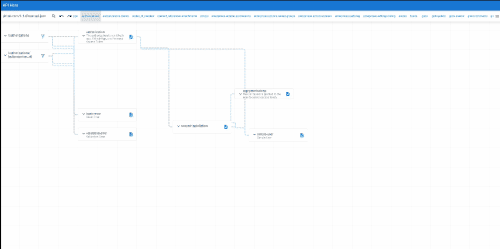

Create interactive directed graphs using rich components, leveraging a generic model.

## Features
* Allow arbitrary data to be mapped into node and edge objects using a simple interface.
* Containers for both graph and menu custom widgets.
* Extensible anchors for edge-connections.  Sane defaults to get started quickly.
* Draggable Nodes.
* Global panning.
* Global zooming.

Example Usage:

Live Demo:

https://api-hero.dev

